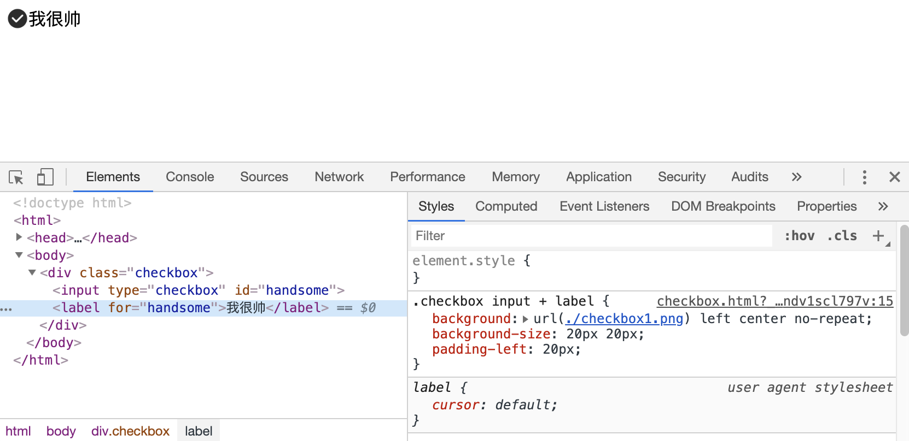
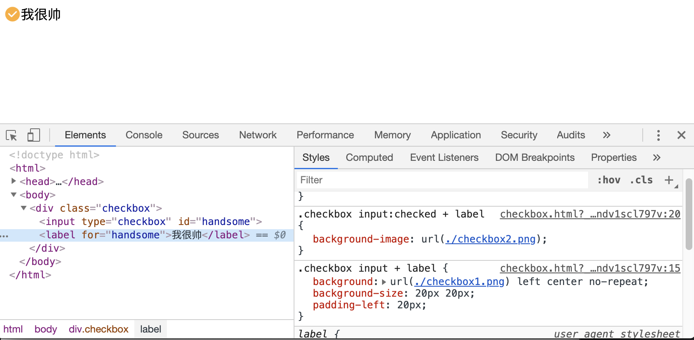
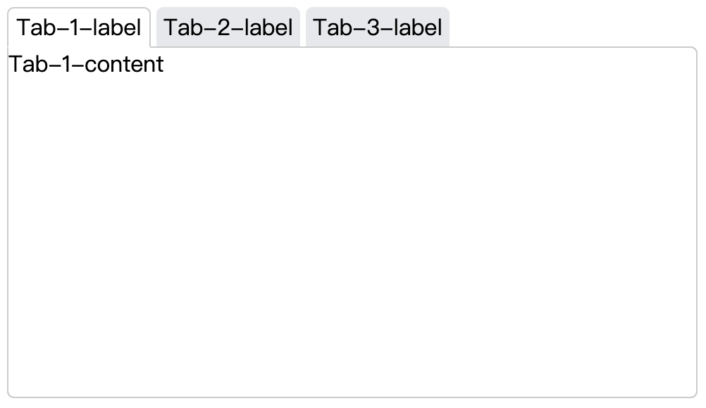
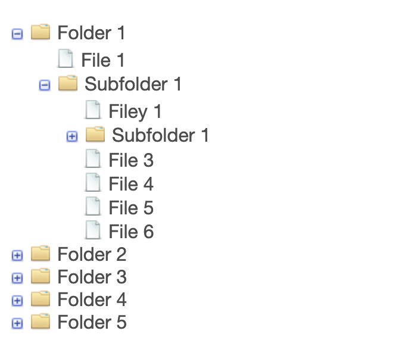

## chart-3

CSS（Cascading Style Sheets 层叠样式表）

层叠：优先级高的会覆盖优先级低的样式

```html
<body class="body" id="body">
  Hello CSS!
</body>
<style>
  body{
    padding: 10px;
    font-size: 14px;
    background:red; 
  }
  body.body{
    font-size: 20px;
    background: red;
  }
  #body{
    background: blue;
  }
</style>
```

### 基本规则

#### 语法

```css
选择器 {
  属性: 值;
  属性: 值
}
```

- `;` 在 CSS 中是分隔符，并不是语句结束符

#### 选择器

- 用于匹配 HTML 元素
- 有不同的匹配规则
- 多个选择器可以叠加

##### 分类和权重

###### 分类

- 元素选择器 a{}
- 伪元素选择器 ::before{}
- 类选择器 .link{}
- 属性选择器 [type=radio]{}
- 伪类选择器 :hover{}
- ID 选择器 #id{}
- 组合选择器 [type=checkbox] + label{}
- 否定选择器 :not(.link){}
- 通用选择器 *{}

###### 权重

- ID 选择器 #id{} +100
- 类 属性 伪类 +10
- 元素 伪元素 +1
- 其他选择器 +0

例如：

```
#id .link a[href]

#id +100
.link +10
a +1
[href] +0
结果：111
```

```
#id .link.active

#id +100
.link +10
.active +10
结果：120
```

需要注意的是选择器的权重的计算是不进位的，即再多的类选择器叠加起来也大不过 ID选择器（官大一级压死人）

- !important 优先级最高
- 元素属性（即内联样式） 优先级高于外部样式
- 相同权重 后者高

##### 解析方式和性能

浏览器解析选择器的方式是从有往左进行解析的，目的是为了更加快速的定位元素，

##### 常见选择器

### 非布局样式

- 字体、自重、颜色、大小、行高

  - 字体族

    - serif sans-serif monospace(等宽字体) cursive fantasy

      字体族不能加引号，具体的字体需要加引号

    - 多字体 fallback

      第一个找不到就用第二个，依次递推

    - 网络字体、自定义字体

    - iconfont

  - 字重（粗体）font-weight

  - 行高

    - 行高的构成

      行高有 line-box 决定的，line-box 是由 inline-box 组成的，inline-box 的高度会决定行高的高度。

    - 行高相关的现象和方案

      - 图片 3px 缝隙问题

        原理：img 是 inline 元素，默认按照基线对其，但基线到底线是有一定距离的。

        解决方案：

        1. vertical-align：bottom
        2. display：block

    - 行高的调整

- 背景、边框

  - 背景

    - 背景颜色

    - 渐变色背景

    - 多背景叠加

    - 背景图片和属性（雪碧图）

      雪碧图，就是只请求一张图片，这张图片包含了所有的图标，通过背景位置来显示具体的某个图标。

    - base64 和性能优化

    - 多分辨率适配

  - 边框

    - 线型、大小、颜色
    - 边框背景图
      - 边框衔接（三角形）

- 滚动、换行

  - 滚动
    - 滚动行为和滚动条
  - 文字折行
    - overflow-wrap（word-wrap）通用换行控制
      - 是否保留单词
    - word-break 针对多子节文字
      - 中文句子也是单词
    - white-space 空白处是否断行

- 粗体、斜体、下划线

  - 字重（粗体）font-weight
  - 斜体 font-style: itatic
  - 下划线 text-decoration
  - 指针 cursor

- 其他

#### CSS Hack

- 在一部分浏览器上生效的写法称为 CSS Hack。Hack 即不合法但生效的写法，主要用于区分不同的浏览器。

- 缺点：难理解、难维护、易失效。

- 替代方案：特性检测，针对性加 class

#### 案例

##### 使用纯 CSS 来美化一个 checkbox

效果：





```html
<body>
  <div class="checkbox">
    <input type="checkbox" id="handsome"/>
    <label for="handsome">我很帅</label>
  </div>
</body>

<style>
  .checkbox input{
    display: none;
  }
   /* 
  A + B
  相邻兄弟选择器：B是A的下一个兄弟节点（AB有相同的父结点，并且B紧跟在A的后面） 
  */
  .checkbox input + label{
    /*
    background:url(./checkbox1.png) left center no-repeat;
    等价于：
    - background-image: url(./checkbox1.png);
    - background-position: left center;
    - background-repeat: no-repeat;
    */
    background:url(./checkbox1.png) left center no-repeat;
    background-size:20px 20px;
    padding-left:20px;
  }
	/* :checked 伪类，表示选中状态 */
  .checkbox input:checked + label{
    background-image:url(./checkbox2.png);
  }
</style>
```

##### tabs

效果：




核心代码：

```html
<body>
    <div class="tabs">
        <div class="tab-item">
            <input type="radio" name="tab-radio" id="tab-radio-1" checked/>
            <label for="tab-radio-1">Tab-1-label</label>
            <div class="tab-content">Tab-1-content</div>
        </div>
        <div class="tab-item">
            <input type="radio" name="tab-radio" id="tab-radio-2"/>
            <label for="tab-radio-2">Tab-2-label</label>
            <div class="tab-content">Tab-2-content</div>
        </div>
        <div class="tab-item">
            <input type="radio" name="tab-radio" id="tab-radio-3"/>
            <label for="tab-radio-3">Tab-3-label</label>
            <div class="tab-content">Tab-3-content</div>
        </div>
    </div>
</body>
<style>
  .tabs{
    display: flex;
    position: relative;
  }
  .tab-item .tab-content{
    position: absolute;
    left: 0;
    top: 28px;
    z-index: 0;
    width: 400px;
    height: 200px;
    border: 1px solid;
    background: #fff;
  }
  input[type='radio']:checked ~ .tab-content{
    z-index: 5;
  }
</style>
```

[完整代码](cases/case2/tabs-use-css.html)

##### tree

> [Pure CSS collapsible tree menu](https://www.thecssninja.com/css/css-tree-menu)
>
> [View live demo](http://www.thecssninja.com/demo/css_tree/)



[完整代码](../chart-3/cases/case3/my-demo/index.html)

